<p align="center">
  
</p>

<p align="center">
  <strong>Agentic infrastructure for physical fabrication via 3D printing.</strong>
</p>

<p align="center">
  <a href="https://github.com/codeofaxel/Kiln/actions/workflows/ci.yml"></a>
  <a href="https://pypi.org/project/kiln3d/"></a>
  <a href="https://pypi.org/project/kiln3d/"></a>
  <a href="https://github.com/codeofaxel/Kiln/blob/main/LICENSE"></a>
</p>

---

<p align="center">
  
</p>

Kiln lets AI agents design, queue, and execute physical manufacturing jobs on real 3D printers with zero human intervention. It exposes printer control through both a **CLI** and the **Model Context Protocol (MCP)**, making any MCP-compatible agent (Claude, GPT, custom) a first-class operator of your print farm.

### Three ways to print

| Mode | What it is | You need |
|------|-----------|----------|
| **🖨️ Your printer** | Control OctoPrint, Moonraker, Bambu, or Prusa Connect printers on your LAN — or remotely via Bambu Cloud | A 3D printer |
| **🏭 Fulfillment centers** | Outsource to Craftcloud (150+ services), Sculpteo (75+ materials), or other providers. Kiln handles quoting, ordering, and tracking | Nothing — no printer required |
| **🌐 Distributed network** | Send jobs to printers on the 3DOS peer-to-peer network, or register your own printer to earn revenue from incoming jobs | Nothing — or a printer to earn |

All three modes use the same MCP tools and CLI commands. An agent can seamlessly fall back from a busy local printer to a fulfillment center, or route specialty materials to the 3DOS network — all in one workflow.

## Architecture

```mermaid
graph TD
    A["🤖 AI Agent<br/><sub>Claude · GPT · Custom</sub>"]
    A -->|"CLI or MCP"| B["⚙️ Kiln<br/><sub>CLI + MCP Server</sub>"]

    B --> C["🖨️ Your Printers"]
    B --> F["🏭 Fulfillment"]
    B --> N["🌐 3DOS Network"]
    B --> D["🛒 Marketplaces"]

    C --> E1["OctoPrint"]
    C --> E2["Moonraker"]
    C --> E3["Bambu"]

    F --> F1["Craftcloud"]
    F --> F2["Sculpteo"]

    N --> N1["Remote Printers"]

    D --> H["Thingiverse"]
    D --> I["MyMiniFactory"]
    D --> J["Cults3D"]

    style A fill:#1a1a2e,stroke:#e94560,color:#fff
    style B fill:#16213e,stroke:#0f3460,color:#fff
    style C fill:#0f3460,stroke:#e94560,color:#fff
    style F fill:#0f3460,stroke:#27ae60,color:#fff
    style N fill:#0f3460,stroke:#f39c12,color:#fff
    style D fill:#0f3460,stroke:#533483,color:#fff
    style E1 fill:#2d2d44,stroke:#e94560,color:#fff
    style E2 fill:#2d2d44,stroke:#e94560,color:#fff
    style E3 fill:#2d2d44,stroke:#e94560,color:#fff
    style F1 fill:#2d2d44,stroke:#27ae60,color:#fff
    style F2 fill:#2d2d44,stroke:#27ae60,color:#fff
    style N1 fill:#2d2d44,stroke:#f39c12,color:#fff
    style H fill:#2d2d44,stroke:#533483,color:#fff
    style I fill:#2d2d44,stroke:#533483,color:#fff
    style J fill:#2d2d44,stroke:#533483,color:#fff
```



## Packages

This monorepo contains two packages:

| Package | Description | Entry Point |
|---------|-------------|-------------|
| **kiln** | CLI + MCP server for multi-printer control (OctoPrint, Moonraker, Bambu, Prusa Connect) | `kiln` or `python -m kiln` |
| **octoprint-cli** | Lightweight standalone CLI for OctoPrint-only setups | `octoprint-cli` |

## Quick Start

### Kiln CLI

```bash
# One-line install (clones repo + installs via pipx)
git clone https://github.com/codeofaxel/Kiln.git ~/.kiln/src && ~/.kiln/src/install.sh

# Or install manually from a local clone
pip install -e ./kiln

# Discover printers on your network
kiln discover

# Add a printer
kiln auth --name my-printer --host http://octopi.local --type octoprint --api-key YOUR_KEY

# Check printer status
kiln status

# Upload and print a file
kiln upload model.gcode
kiln print model.gcode

# Slice an STL and print in one step
kiln slice model.stl --print-after

# Batch print multiple files
kiln print *.gcode --queue

# Monitor a running print
kiln wait

# Take a webcam snapshot
kiln snapshot --save photo.jpg

# View print history
kiln history --status completed

# All commands support --json for agent consumption
kiln status --json
```

### Linux / WSL 2

Kiln runs natively on Linux and Ubuntu under WSL 2.

#### Option 1: pipx (recommended)

`pipx` installs Kiln into its own isolated environment and puts the `kiln`
command on your PATH — works from any directory, no virtualenv to manage.

> **Note:** The pip package name is **`kiln3d`** (not `kiln`). This matters
> for `pipx uninstall`, `pip show`, etc. The CLI command is still `kiln`.

```bash
# One-time: install pipx
sudo apt install pipx
pipx ensurepath   # adds ~/.local/bin to PATH (restart your shell after)

# Clone and install
git clone https://github.com/codeofaxel/Kiln.git
cd Kiln
pipx install ./kiln

# System dependencies (optional but recommended)
sudo apt install prusa-slicer   # Required for slicing STL → G-code
sudo apt install openscad        # Required only for text-to-3D generation

# Verify
kiln verify
```

#### Uninstall / Update

```bash
# Uninstall (package name is kiln3d, not kiln)
pipx uninstall kiln3d

# Update to latest version (if installed from a git clone)
cd Kiln
git pull
pipx install --force ./kiln

# Check what pipx has installed (useful for troubleshooting)
pipx list
```

#### Option 2: virtualenv

If you prefer a manual virtualenv:

```bash
python3 -m venv ~/.kiln-venv
source ~/.kiln-venv/bin/activate

git clone https://github.com/codeofaxel/Kiln.git
cd Kiln
pip install -e ./kiln            # includes all printer backends (OctoPrint, Moonraker, Bambu, Prusa Connect)

kiln verify
```

> **Tip:** Add `source ~/.kiln-venv/bin/activate` to your `~/.bashrc` so
> the `kiln` command is always available when you open a terminal.

**WSL 2 networking note:** WSL 2 uses a virtual network (NAT), so mDNS printer
discovery (`kiln discover`) will not find printers on your home network. Instead,
connect directly by IP:

```bash
# 1. Find your printer's IP (check your router or Moonraker/OctoPrint web UI)
# 2. Verify connectivity from WSL
curl http://192.168.1.100:7125/server/info   # Moonraker (Klipper)
curl http://192.168.1.100/api/version        # OctoPrint

# 3. Register the printer with Kiln
kiln auth --name my-printer --host http://192.168.1.100:7125 --type moonraker

# 4. Check printer status
kiln status
```

If PrusaSlicer is not in your PATH, set it explicitly:
```bash
export KILN_SLICER_PATH=/path/to/prusa-slicer
```

**Bambu webcam snapshots** require `ffmpeg` for RTSP frame capture. Install it if you want vision monitoring on Bambu printers:
```bash
# macOS
brew install ffmpeg

# Ubuntu/Debian
sudo apt install ffmpeg
```
Without `ffmpeg`, Bambu printers will work normally but `can_snapshot` will be `False` and vision monitoring tools won't capture frames.

### CLI Commands

```
kiln discover                              # Scan network for printers (mDNS)
kiln auth --name N --host H --type T       # Save printer credentials
kiln status [--json]                       # Printer state + job progress
kiln files [--json]                        # List files on printer
kiln upload <file> [--json]                # Upload G-code file
kiln print <files>... [--queue] [--json]   # Start printing (supports batch + queue)
kiln cancel [--json]                       # Cancel current print
kiln pause [--json]                        # Pause current print
kiln resume [--json]                       # Resume paused print
kiln temp [--tool N] [--bed N] [--json]    # Get/set temperatures
kiln gcode <cmds>... [--json]              # Send raw G-code
kiln printers [--json]                     # List saved printers
kiln use <name>                            # Switch active printer
kiln remove <name>                         # Remove a saved printer
kiln preflight [--material MAT] [--json]   # Pre-print safety checks
kiln slice <file> [--print-after] [--json] # Slice STL/3MF to G-code
kiln snapshot [--save PATH] [--json]       # Capture webcam snapshot
kiln wait [--timeout N] [--json]           # Wait for print to finish
kiln history [--status S] [--json]         # View past prints
kiln order materials [--json]              # List fulfillment materials
kiln order quote <file> -m MAT [--json]   # Get manufacturing quote
kiln order place <quote_id> [--json]      # Place a fulfillment order
kiln order status <order_id> [--json]     # Track order status
kiln order cancel <order_id> [--json]     # Cancel an order
kiln cost <file> [--material PLA] [--json]    # Estimate print cost
kiln material set|show|spools|add-spool       # Material tracking
kiln level [--status] [--trigger] [--json]    # Bed leveling triggers
kiln stream [--port 8081] [--stop] [--json]   # Webcam MJPEG proxy
kiln sync status|now|configure                # Cloud sync
kiln plugins list|info                        # Plugin management
kiln generate "a phone stand" --provider meshy --json   # Generate 3D model from text
kiln generate-status <job_id> --json                    # Check generation status
kiln generate-download <job_id> -o ./models --json      # Download generated model
kiln firmware status --json                # Check for firmware updates
kiln firmware update [--component klipper] # Apply firmware updates
kiln firmware rollback <component>         # Roll back firmware
kiln network register --name N --location L # Register printer on 3DOS network
kiln network find --material PLA           # Find network printers by material
kiln network submit URL --material PLA     # Submit job to 3DOS network
kiln network status <job_id>               # Check network job status
kiln network list                          # List your registered network printers
kiln network update <id> --available       # Update printer availability
kiln setup                                 # Interactive printer setup wizard
kiln serve                                 # Start MCP server
kiln rest [--port 8420] [--tier full]      # Start REST API server
kiln agent [--model openai/gpt-4o]         # Interactive agent REPL (any LLM)
```

The REST API can be deployed to Fly.io for production use — see `deploy.sh` for one-command deployment.

```
```

Global option: `--printer <name>` to target a specific printer per-command.

### MCP Server

```bash
# Start the MCP server
kiln serve

# Or with environment variables
export KILN_PRINTER_HOST=http://octopi.local
export KILN_PRINTER_API_KEY=your_api_key
export KILN_PRINTER_TYPE=octoprint
kiln serve
```

#### Claude Desktop Integration

Add to `~/.config/Claude/claude_desktop_config.json`:

```json
{
  "mcpServers": {
    "kiln": {
      "command": "python",
      "args": ["-m", "kiln", "serve"],
      "env": {
        "KILN_PRINTER_HOST": "http://octopi.local",
        "KILN_PRINTER_API_KEY": "your_key",
        "KILN_PRINTER_TYPE": "octoprint"
      }
    }
  }
}
```

### Multi-Model Support (OpenRouter / Any LLM)

Kiln works with **any** LLM that supports OpenAI-compatible function calling — not just Claude.

```bash
# Interactive agent REPL with any model via OpenRouter
export KILN_OPENROUTER_KEY=sk-or-...
kiln agent --model openai/gpt-4o
kiln agent --model anthropic/claude-sonnet-4
kiln agent --model meta-llama/llama-3.1-70b-instruct --tier essential

# REST API mode — any HTTP client can call Kiln tools
kiln rest --port 8420 --tier full
# POST http://localhost:8420/api/tools/printer_status
# GET  http://localhost:8420/api/tools

# Install with REST API support
pip install kiln3d[rest]
```

Tool tiers automatically match model capability: **essential** (15 tools) for smaller models, **standard** (43 tools) for mid-range, **full** (124 tools) for Claude/GPT-4/Gemini.

### OctoPrint CLI

```bash
# Install
pip install -e ./octoprint-cli

# Initialize config
octoprint-cli init --host http://octopi.local --api-key YOUR_KEY

# Use
octoprint-cli status
octoprint-cli files
octoprint-cli print myfile.gcode --confirm
```

## MCP Tools

The Kiln MCP server (`kiln serve`) exposes these tools to agents:

| Tool | Description |
|------|-------------|
| `printer_status` | Get printer state, temperatures, job progress |
| `printer_files` | List available G-code files |
| `upload_file` | Upload a local G-code file to the printer |
| `start_print` | Start printing a file |
| `cancel_print` | Cancel the active print job |
| `pause_print` | Pause the active print |
| `resume_print` | Resume a paused print |
| `set_temperature` | Set hotend and/or bed temperature |
| `preflight_check` | Run safety checks before printing |
| `send_gcode` | Send raw G-code commands |
| `validate_gcode` | Validate G-code without sending |
| `fleet_status` | Get status of all registered printers |
| `register_printer` | Add a printer to the fleet |
| `submit_job` | Submit a print job to the queue |
| `job_status` | Check status of a queued job |
| `queue_summary` | Overview of the job queue |
| `cancel_job` | Cancel a queued or running job |
| `recent_events` | Get recent events from the event bus |
| `kiln_health` | System health check (version, uptime, modules) |
| `register_webhook` | Register a webhook for event notifications |
| `list_webhooks` | List all registered webhooks |
| `delete_webhook` | Remove a webhook endpoint |
| `search_all_models` | Search Thingiverse, MyMiniFactory, and Cults3D simultaneously |
| `marketplace_info` | Show connected marketplaces and setup hints |
| `search_models` | Search Thingiverse for 3D models |
| `model_details` | Get details for a Thingiverse model |
| `model_files` | List files for a Thingiverse model |
| `download_model` | Download a model file from Thingiverse |
| `download_and_upload` | Download from any marketplace and upload to printer in one step |
| `browse_models` | Browse popular/newest/featured models |
| `list_model_categories` | List Thingiverse categories |
| `slice_model` | Slice an STL/3MF file to G-code |
| `find_slicer_tool` | Detect installed slicer (PrusaSlicer/OrcaSlicer) |
| `slice_and_print` | Slice a model then upload and print in one step |
| `printer_snapshot` | Capture a webcam snapshot from the printer |
| `fulfillment_materials` | List materials from external print services (Craftcloud, Sculpteo) |
| `fulfillment_quote` | Get a manufacturing quote for a 3D model |
| `fulfillment_order` | Place an order based on a quote |
| `fulfillment_order_status` | Track a fulfillment order |
| `fulfillment_cancel` | Cancel a fulfillment order |
| `estimate_cost` | Estimate print cost from G-code file |
| `list_materials` | List available material profiles |
| `set_material` | Set loaded material on a printer |
| `get_material` | Get loaded material for a printer |
| `check_material_match` | Verify material matches expected |
| `list_spools` | List spool inventory |
| `add_spool` | Add a spool to inventory |
| `remove_spool` | Remove a spool from inventory |
| `bed_level_status` | Get bed leveling status for a printer |
| `trigger_bed_level` | Trigger bed leveling on a printer |
| `set_leveling_policy` | Configure auto-leveling policy |
| `webcam_stream` | Start/stop/status MJPEG stream proxy |
| `cloud_sync_status` | Get cloud sync status |
| `cloud_sync_now` | Trigger immediate sync |
| `cloud_sync_configure` | Configure cloud sync settings |
| `list_plugins` | List installed plugins |
| `plugin_info` | Get details for a specific plugin |
| `await_print_completion` | Poll until a print job finishes (completed/failed/cancelled/timeout) |
| `compare_print_options` | Side-by-side local vs. fulfillment cost comparison |
| `analyze_print_failure` | Diagnose a failed print job with causes and recommendations |
| `validate_print_quality` | Post-print quality assessment with snapshot and event analysis |
| `generate_model` | Generate a 3D model from a text description (Meshy AI or OpenSCAD) |
| `generation_status` | Check the status of a model generation job |
| `download_generated_model` | Download a completed generated model with mesh validation |
| `await_generation` | Wait for a generation job to complete (polling) |
| `generate_and_print` | Full pipeline: generate -> validate -> slice -> upload -> print |
| `validate_generated_mesh` | Validate an STL/OBJ mesh for printing readiness |
| `firmware_status` | Check for available firmware updates on the printer |
| `update_firmware` | Start a firmware update (all or specific component) |
| `rollback_firmware` | Roll back a firmware component to its previous version |
| `print_history` | Get recent print history with success/failure tracking |
| `printer_stats` | Aggregate stats for a printer (total prints, success rate, avg duration) |
| `annotate_print` | Add notes to a completed print record |
| `save_agent_note` | Save a persistent note/preference that survives across sessions |
| `get_agent_context` | Retrieve all stored agent memory for context |
| `delete_agent_note` | Remove a stored note or preference |
| `list_safety_profiles` | List all bundled printer safety profiles (26 models) |
| `get_safety_profile` | Get temperature/feedrate/flow limits for a specific printer |
| `validate_gcode_safe` | Validate G-code against printer-specific safety limits |
| `list_slicer_profiles_tool` | List all bundled slicer profiles with recommended settings |
| `get_slicer_profile_tool` | Get full slicer settings (speeds, retraction, temps) for a printer |
| `get_printer_intelligence` | Firmware quirks, material compatibility, calibration guidance |
| `get_material_recommendation` | Recommended hotend/bed/fan settings for a material on a printer |
| `troubleshoot_printer` | Diagnose printer issues from known failure modes database |
| `list_print_pipelines` | List available pre-validated pipelines (quick_print, calibrate, benchmark) |
| `run_quick_print` | Full pipeline: slice → validate → upload → print in one shot |
| `run_calibrate` | Home → bed level → calibration guidance pipeline |
| `run_benchmark` | Slice → upload → stats report (manual start) |
| `monitor_print_vision` | Capture snapshot + printer state + print phase hints for agent vision analysis |
| `watch_print` | Poll printer with periodic snapshots; returns batch for agent review |
| `record_print_outcome` | Record print quality outcome with safety-validated settings |
| `get_printer_insights` | Query cross-printer learning: success rates, failure breakdown, material stats |
| `suggest_printer_for_job` | Rank printers by historical success for a file/material combination |
| `recommend_settings` | Recommend print settings (temps, speed, slicer profile) from historical successes |
| `network_register_printer` | Register a local printer on the 3DOS distributed manufacturing network |
| `network_update_printer` | Update a printer's availability on the 3DOS network |
| `network_list_printers` | List printers registered by this account on the 3DOS network |
| `network_find_printers` | Search for available printers on the 3DOS network by material/location |
| `network_submit_job` | Submit a print job to the 3DOS distributed manufacturing network |
| `network_job_status` | Check the status of a job on the 3DOS network |
| `billing_status` | Get billing status, fee policy, and payment methods |
| `billing_summary` | Aggregated billing summary |
| `billing_history` | Recent billing charges and payment outcomes |
| `billing_setup_url` | Get URL to link a payment method (Stripe) |
| `safety_audit` | Audit safety compliance across jobs |
| `safety_settings` | Get current safety and auto-print settings |
| `safety_status` | Comprehensive safety status check |
| `delete_file` | Delete a file from the printer |
| `cache_model` | Cache a downloaded model locally for reuse |
| `search_cached_models` | Search cached models by name, source, or tags |
| `list_cached_models` | List all cached models with metadata |
| `get_cached_model` | Get details and local path for a cached model |
| `delete_cached_model` | Remove a model from the local cache |
| `backup_database` | Create a timestamped backup of the Kiln SQLite database |
| `verify_audit_integrity` | Verify integrity of the audit log (hash chain validation) |
| `clean_agent_memory` | Prune stale or expired agent memory entries |
| `list_trusted_printers` | List printers in the trust store with verification status |
| `trust_printer` | Add a printer to the trust store (fingerprint + TLS pinning) |
| `untrust_printer` | Remove a printer from the trust store |
| `pipeline_status` | Get real-time status of a running pipeline |
| `pipeline_pause` | Pause a running pipeline at the current step boundary |
| `pipeline_resume` | Resume a paused pipeline |
| `pipeline_abort` | Abort a running or paused pipeline |
| `pipeline_retry_step` | Retry the failed step in a pipeline |
| `consumer_onboarding` | Step-by-step guide for users without a 3D printer |
| `validate_shipping_address` | Validate and normalize a shipping address |
| `recommend_material` | Recommend material by use case (decorative, functional, outdoor, etc.) |
| `estimate_price` | Instant price estimate before requesting a full quote |
| `estimate_timeline` | Order-to-delivery timeline with per-stage breakdown |
| `fulfillment_compare_providers` | Side-by-side quotes from all fulfillment providers |
| `fulfillment_filter_materials` | Search/filter materials by technology, color, price |
| `fulfillment_batch_quote` | Quote multiple parts in one operation (assemblies) |
| `fulfillment_provider_health` | Health status of all fulfillment providers |
| `fulfillment_order_history` | View past orders for status review or reorder |
| `fulfillment_reorder` | Look up past order details for easy reordering |
| `fulfillment_insurance_options` | Shipping insurance/protection options with pricing |
| `supported_shipping_countries` | List countries supported for fulfillment shipping |

## Supported Printers

| Backend | Status | Printers |
|---------|--------|----------|
| **OctoPrint** | Stable | Any OctoPrint-connected printer (Prusa, Ender, custom) |
| **Moonraker** | Stable | Klipper-based printers (Voron, Ratrig, etc.) |
| **Bambu** | Stable | Bambu Lab X1C, P1S, A1 (via LAN MQTT) |
| **Prusa Connect** | Stable | Prusa MK4, XL, Mini+ (via Prusa Link REST API) |

## MCP Resources

The server also exposes read-only resources that agents can use for context:

| Resource URI | Description |
|---|---|
| `kiln://status` | System-wide snapshot (printers, queue, events) |
| `kiln://printers` | Fleet listing with idle printers |
| `kiln://printers/{name}` | Detailed status for a specific printer |
| `kiln://queue` | Job queue summary and recent jobs |
| `kiln://queue/{job_id}` | Detail for a specific job |
| `kiln://events` | Recent events (last 50) |

## Modules

| Module | Description |
|---|---|
| `server.py` | MCP server with tools, resources, and subsystem wiring |
| `printers/` | Printer adapter abstraction (OctoPrint, Moonraker, Bambu, Prusa Connect) |
| `marketplaces/` | Model marketplace adapters (Thingiverse, MyMiniFactory, Cults3D) |
| `slicer.py` | Slicer integration (PrusaSlicer, OrcaSlicer) with auto-detection |
| `registry.py` | Fleet registry for multi-printer management |
| `queue.py` | Priority job queue with status tracking |
| `scheduler.py` | Background job dispatcher with history-based smart routing |
| `events.py` | Pub/sub event bus with history |
| `persistence.py` | SQLite storage for jobs, events, and settings |
| `webhooks.py` | Event-driven webhook delivery with HMAC signing |
| `auth.py` | Optional API key authentication with scope-based access |
| `billing.py` | Fee tracking for 3DOS network-routed jobs |
| `discovery.py` | Network printer discovery (mDNS + HTTP probe) |
| `generation/` | Text-to-model generation providers (Meshy AI, OpenSCAD) with mesh validation |
| `consumer.py` | Consumer workflow for non-printer users (address validation, material recommendations, timeline/price estimation, onboarding) |
| `fulfillment/` | External manufacturing service adapters (Craftcloud, Sculpteo) with intelligence layer (provider health, multi-provider comparison, batch quoting, retry/fallback, order history, shipping insurance) |
| `cost_estimator.py` | Print cost estimation from G-code analysis |
| `materials.py` | Multi-material and spool tracking |
| `bed_leveling.py` | Automated bed leveling trigger system |
| `streaming.py` | MJPEG webcam streaming proxy |
| `cloud_sync.py` | Cloud sync for printer configs and job history |
| `plugins.py` | Plugin system with entry-point discovery |
| `gcode.py` | G-code safety validator with per-printer limits |
| `safety_profiles.py` | Bundled safety database (26 printer models, temps/feedrates/flow) |
| `slicer_profiles.py` | Bundled slicer profiles (auto-generates .ini files per printer) |
| `printer_intelligence.py` | Printer knowledge base (firmware quirks, materials, failure modes) |
| `pipelines.py` | Pre-validated print pipelines (quick_print, calibrate, benchmark) |
| `tool_schema.py` | OpenAI function-calling schema converter (MCP → OpenAI format) |
| `tool_tiers.py` | Tool tier definitions (essential/standard/full) for model capability matching |
| `agent_loop.py` | Generic agent loop for any OpenAI-compatible API (OpenRouter, direct, etc.) |
| `openrouter.py` | OpenRouter integration with model catalog and auto-tier detection |
| `rest_api.py` | REST API wrapper (FastAPI) exposing all MCP tools as HTTP endpoints |
| `data/` | Bundled JSON databases (safety profiles, slicer profiles, printer intelligence) |
| `payments/` | Payment processing (Stripe, Circle USDC, crypto rails) |
| `gateway/` | 3DOS distributed manufacturing network gateway |
| `heater_watchdog.py` | Auto-cooldown watchdog for idle heaters |
| `licensing.py` | License tier management (Free/Pro/Business, offline-first) |
| `wallets.py` | Crypto wallet configuration (Solana/Ethereum for donations and fees) |
| `cli/` | Click CLI with 50+ subcommands and JSON output |

## Authentication (Optional)

Kiln supports optional API key authentication for MCP tools. Disabled by default.

```bash
# Enable auth
export KILN_AUTH_ENABLED=1
export KILN_AUTH_KEY=your_secret_key

# Clients provide their key via
export KILN_MCP_AUTH_TOKEN=your_secret_key
```

Scopes: `print`, `files`, `queue`, `temperature`, `admin`. Read-only tools (status, list) never require auth.

## Webhooks

Register HTTP endpoints to receive real-time event notifications:

```
register_webhook(url="https://example.com/hook", events=["job.completed", "print.failed"])
```

Payloads are signed with HMAC-SHA256 when a secret is provided.

## Printer Discovery

Kiln can automatically find printers on your local network:

```bash
kiln discover
```

Discovery uses mDNS/Bonjour and HTTP subnet probing to find OctoPrint, Moonraker, and Bambu printers.

## Model Marketplaces

Kiln includes adapters for discovering and downloading 3D models from popular marketplaces:

| Marketplace | Status | Features |
|---|---|---|
| **Thingiverse** | Stable | Search, browse, download, categories |
| **MyMiniFactory** | Stable | Search, details, download |
| **Cults3D** | Stable | Search, details (metadata-only, no direct download) |

Configure credentials for the marketplaces you use:

```bash
export KILN_THINGIVERSE_TOKEN=your_token       # Thingiverse
export KILN_MMF_API_KEY=your_key               # MyMiniFactory
export KILN_CULTS3D_USERNAME=your_username      # Cults3D
export KILN_CULTS3D_API_KEY=your_key            # Cults3D
```

All configured marketplaces are searched simultaneously via `search_all_models`. Agents can inspect details, download files, and upload directly to a printer — enabling a full design-to-print workflow without human intervention.

## Slicer Integration

Kiln wraps PrusaSlicer and OrcaSlicer for headless slicing. Auto-detects installed slicers on PATH, macOS app bundles, or via `KILN_SLICER_PATH`.

```bash
# Slice an STL to G-code
kiln slice model.stl

# Slice and immediately print
kiln slice model.stl --print-after

# Supported formats: STL, 3MF, STEP, OBJ, AMF
```

## Webcam Snapshots

Capture point-in-time images from printer webcams for monitoring and quality checks:

```bash
# Save snapshot to file
kiln snapshot --save photo.jpg

# Get base64-encoded snapshot (for agents)
kiln snapshot --json
```

Supported on OctoPrint, Moonraker, and Prusa Connect backends. Agents use the `printer_snapshot` MCP tool.

## Fulfillment Services

Print through external manufacturing services — **no 3D printer required**, or use alongside your own printers for overflow, specialty materials, or production runs. Kiln handles the entire workflow from idea to delivered product:

```bash
# Get material recommendations for your use case
kiln order recommend functional --budget budget

# Instant price estimate (no API call needed)
kiln order estimate FDM --x 80 --y 60 --z 40

# Estimate delivery timeline
kiln order timeline SLA --country US

# List available materials (FDM, SLA, SLS, MJF, etc.)
kiln order materials

# Get a quote for a model
kiln order quote model.stl --material pla-white --quantity 2

# Validate your shipping address
kiln order validate-address --street "123 Main St" --city Austin --state TX --postal-code 78701 --country US

# View shipping insurance options
kiln order insurance 45.00

# Place the order
kiln order place q-abc123 --shipping std

# Track order status
kiln order status o-def456

# View order history
kiln order history

# List supported shipping countries
kiln order countries
```

Configure your fulfillment provider:

```bash
# Option 1: Auto-detect from API key (Craftcloud is default)
export KILN_CRAFTCLOUD_API_KEY=your_key

# Option 2: Sculpteo
export KILN_SCULPTEO_API_KEY=your_key

# Optional: explicitly select a provider
export KILN_FULFILLMENT_PROVIDER=craftcloud  # or sculpteo
```

Agents use the consumer workflow MCP tools: `consumer_onboarding` for guided setup, `recommend_material` for material selection, `estimate_price` / `estimate_timeline` for quick estimates, `fulfillment_compare_providers` for cross-provider quotes, `fulfillment_batch_quote` for multi-part assemblies, and `fulfillment_order_history` / `fulfillment_reorder` for repeat orders.

## Development

```bash
# Create a virtualenv first (required on modern Ubuntu/Debian/WSL)
python3 -m venv .venv && source .venv/bin/activate

# Install both packages in dev mode
pip install -e "./kiln[dev]"
pip install -e "./octoprint-cli[dev]"

# Run tests (3,650+ total)
cd kiln && python3 -m pytest tests/ -v        # 3,415 tests (approximately)
cd ../octoprint-cli && python3 -m pytest tests/ -v  # 239 tests
```

## Revenue Model

All local printing is **free forever** — status checks, file management, slicing, fleet control, and printing to your own printers costs nothing.

Kiln charges a **5% platform fee** on orders placed through external manufacturing services (`kiln order` / fulfillment MCP tools), with:

- First 5 outsourced orders per month **free**
- $0.25 minimum / $200 maximum per-order cap

The fee is shown transparently in every quote before you commit.

### Licensing Tiers

| Tier | Price | What You Get |
|------|-------|-------------|
| **Free** | $0 | All local printing, slicing, marketplace, safety profiles. Job queue (10 jobs). Up to 2 printers. Billing visibility. |
| **Pro** | $29/mo | Unlimited printers + fleet orchestration, fleet analytics, unlimited queue depth, cloud sync, priority scheduler. |
| **Business** | $99/mo | Everything in Pro + unlimited fulfillment orders (5% fee), hosted deployment, priority support. |

Run `kiln upgrade` to activate a license key.

## Safety

Kiln is safety-first infrastructure for controlling physical machines:

- **Pre-flight checks** validate printer state, temperatures, and files before every print
- **G-code validation** blocks dangerous commands (firmware reset, unsafe temperatures)
- **Temperature limits** enforce safe maximums (300C hotend, 130C bed)
- **Confirmation required** for destructive operations (cancel, raw G-code)
- **Optional authentication** with scope-based API keys for multi-user setups
- **Structured errors** ensure agents always know when something fails

## Brand Assets

Logo files live in [`docs/assets/`](docs/assets/):

| File | Use |
|------|-----|
| `kiln-banner-1280x640.svg` | GitHub / social media banner |
| `kiln-logo-dark.svg` | Primary mark + wordmark (dark bg) |
| `kiln-logo-light.svg` | Mark + wordmark (light bg) |
| `kiln-horizontal-dark.svg` | Horizontal lockup (dark bg) |
| `kiln-horizontal-light.svg` | Horizontal lockup (light bg) |
| `kiln-logo-dark-notext.svg` | Mark only (dark bg) |
| `kiln-favicon-256.svg` | Favicon / app icon |
| `kiln-logo-transparent.svg` | Transparent bg (for dark UIs) |
| `kiln-logo-transparent-dark.svg` | Transparent bg (for light UIs) |
| `kiln-pfp-1024.svg` | Social media profile picture with subtle glow (1024×1024) |
| `kiln-pfp-1024-flat.svg` | Social media profile picture, no glow (1024×1024) |
| `wallpapers/kiln-wallpaper-iphone-*.svg` | iPhone wallpapers (15, 15 Pro/Max, 16, 16 Pro/Max, 17, 17 Air, 17 Pro/Max) |
| `wallpapers/kiln-wallpaper-macbook-*.svg` | MacBook wallpapers (Air 13/15, Pro 14/16) |

All files are vector SVG — scale to any size.

## Documentation

| Document | Description |
|----------|-------------|
| [Litepaper](docs/LITEPAPER.md) | Quick overview for non-technical readers |
| [Whitepaper](docs/WHITEPAPER.md) | Full technical architecture and protocol design |
| [Project Docs](docs/PROJECT_DOCS.md) | Complete reference (CLI, MCP tools, adapters, config) |

## Support Development

Kiln is free, open-source software. If you find it useful, consider sending a tip:

- **Solana:** `kiln3d.sol`
- **Ethereum:** `kiln3d.eth`

## License

MIT
