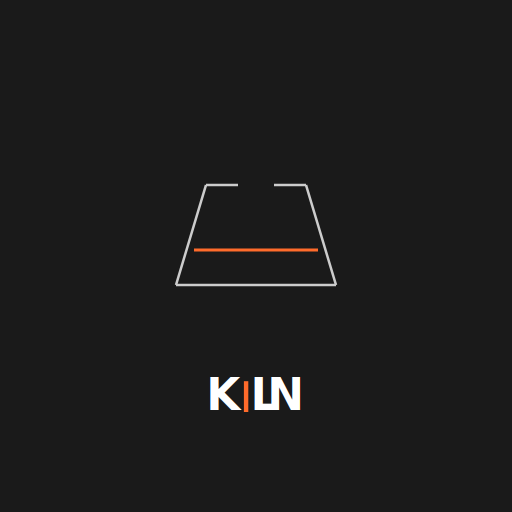

<p align="center">
  
</p>

# Kiln

### Litepaper -- February 2026

---

Kiln is free, open-source infrastructure that lets AI agents control 3D printers. It sits between any AI -- Claude, GPT, Llama, or others -- and your printers, giving the agent the ability to find models, slice files, start prints, monitor progress, and manage an entire fleet. Everything runs locally on your network. No cloud accounts, no telemetry, no subscriptions required.

## Positioning Clarification

**Messaging clarification (February 24, 2026):** We clarified wording to remove ambiguity and align with existing intent; no strategy change. Kiln is orchestration and agent infrastructure for fabrication workflows. Kiln does **not** operate a first-party decentralized manufacturing marketplace/network. Kiln integrates with third-party providers and partner networks where integrations are available.

## The Problem

3D printing is powerful, but the software side hasn't kept up. Every printer brand speaks a different language -- OctoPrint, Klipper, Bambu Lab, Elegoo, and Prusa Link each have their own incompatible interfaces. Managing even a small fleet means juggling multiple dashboards, manually queuing jobs, and babysitting prints. Meanwhile, AI agents are increasingly capable of planning and executing multi-step physical tasks, but there's no safe, standardized way to connect them to real hardware.

## The Solution

Kiln acts as a universal translator between AI agents and 3D printers. One interface, any printer, any AI.

**Three ways to print.** Kiln gives agents three co-equal paths to turn a digital file into a physical object -- and they can mix and match within a single workflow:

1. **Your printers.** Control OctoPrint, Moonraker (Klipper), Bambu Lab, Elegoo (Centauri Carbon, Saturn, Mars via SDCP; Neptune 4 and OrangeStorm Giga via Moonraker), or Prusa Link machines on your local network -- or remotely via Bambu Cloud. Your agent doesn't need to know which firmware a printer runs; Kiln handles the translation.

2. **Fulfillment centers.** Send jobs to professional manufacturing services. Craftcloud aggregates quotes from over 150 print services worldwide across FDM, SLA, SLS, MJF, and metal (DMLS) — works out of the box with no API key required. No printer required -- but printer owners use this too for overflow, specialty materials, or production-quality parts. More providers coming soon.

3. **Partner networks (via integration).** *(Coming soon.)* Route jobs to connected third-party manufacturing networks through integration adapters. Kiln does not operate a first-party network marketplace.

An agent can start a PLA prototype on your desk printer, send the SLA version to Craftcloud, and route overflow to a connected partner network -- all from the same conversation.

**Non-goals:**

- Operating a first-party decentralized manufacturing marketplace/network
- Replacing partner supply-side networks
- Owning provider marketplaces instead of integrating with them
- Acting as merchant of record for provider-routed manufacturing orders

**Beyond printing:**

- **Full print workflow.** An agent can search for 3D models across MyMiniFactory, Cults3D, Thangs, GrabCAD, Etsy, and other marketplaces; slice them into printer-ready files; upload to a printer; start, monitor, and cancel prints -- all without human intervention.

- **Agent-designed models.** Kiln's universal generation adapter auto-discovers text-to-3D providers from environment variables. Cloud providers include Meshy, Tripo3D, and Stability AI -- each turning a natural-language description into a printable mesh. Google Gemini Deep Think uses AI reasoning to convert text or napkin-sketch descriptions into precise OpenSCAD geometry, compiled locally to STL. For fully parametric parts, the OpenSCAD provider lets agents write code directly. New providers can be added in under 100 lines. Generated models are automatically validated for printability -- manifold checks, triangle counts, bounding box dimensions -- before they ever reach a slicer. An agent can go from "I need a 40mm fan duct with a 30-degree deflection" to a sliced, printing G-code file with no human in the loop.

- **Fleet management.** A priority job queue routes work across multiple printers, favoring the machine with the best track record for each material and file type. Batch production, scheduling, and cross-printer learning come built in.

- **Vision monitoring.** During a print, the agent can analyze webcam snapshots using its own vision capabilities to detect failures early -- spaghetti, layer shifts, adhesion problems -- and decide whether to pause or cancel.

## How It Works

```
You (or your agent) --> Kiln --> 🖨️ Your Printers  (local or remote via Bambu Cloud)
                                 🏭 Fulfillment     (Craftcloud)
                                 🌐 Partner Networks (via integration, coming soon)
```

Kiln uses the Model Context Protocol (MCP), an open standard for connecting AI agents to external tools. Any MCP-compatible agent can talk to Kiln natively. For those who prefer a terminal, there's also a full command-line interface with over 80 commands and a REST API for custom integrations.

All three printing modes use the same interface. An agent doesn't need to know whether a job is printing on your desk, at a factory in Germany, or through a connected partner network -- Kiln abstracts the routing. Communication with local printers stays on your network; fulfillment and partner-network jobs use HTTPS to the respective provider APIs.

## Safety

Agents are powerful, but they shouldn't be trusted blindly with physical hardware. Kiln enforces safety at the protocol level -- not as an afterthought, but as a core design constraint.

Before any print starts, Kiln runs pre-flight checks: validating temperatures against per-printer limits, scanning G-code for dangerous commands, and confirming the printer is in a safe state. These checks cannot be bypassed by the agent, even if explicitly instructed to skip them. A background watchdog also auto-cools idle heaters after 30 minutes to prevent fire hazards.

The agent operates within strict guardrails. It has the autonomy to be useful, but not enough rope to cause damage.

## Business Model

Local printing with Kiln is free and always will be. The core software is released under the MIT license.

Revenue comes from optional services:

- **Free tier** -- All local printing features, up to 2 printers and a 10-job queue. No cost, no account required.
- **Pro ($29/month)** -- Unlimited printers, fleet orchestration, analytics, and cloud sync. Annual: $23/mo.
- **Business ($99/month)** -- Up to 50 printers, 5 team seats, fulfillment brokering, shared hosted MCP server, priority support, custom safety profiles. Annual: $79/mo.
- **Enterprise (from $499/month)** -- Unlimited printers (20 included, $15/mo each additional) and unlimited team seats, dedicated single-tenant MCP server, on-premises deployment via Kubernetes and Helm (air-gapped support included), single sign-on via OIDC and SAML (works with Okta, Google Workspace, Azure AD, Auth0), role-based access control (admin/engineer/operator), full audit trail with JSON/CSV export, lockable safety profiles that prevent agent modifications, encrypted G-code at rest, per-printer overage billing via Stripe, 99.9% uptime SLA with rolling health monitoring, and dedicated support channel with onboarding. Annual: $399/mo.

Outsourced manufacturing orders carry a 5% orchestration software fee (first 3 per month are free, with a $0.25 minimum and $200 maximum per order). For provider-routed orders, the provider remains merchant of record.

Crypto donations are also accepted at kiln3d.sol (Solana) and kiln3d.eth (Ethereum).

## Enterprise

For organizations running production print farms, the Enterprise tier adds the controls that IT and compliance teams require: single sign-on through existing identity providers, role-based access so operators can monitor but not modify, admin-lockable safety profiles that agents cannot override, encrypted G-code protecting proprietary designs, and a full audit trail exportable for compliance review. The entire system can be deployed on-premises using the included Kubernetes manifests and Helm chart, with air-gapped environments fully supported. A 99.9% uptime SLA with rolling health monitoring ensures production reliability.

## Get Started

Install Kiln with a single command:

```
git clone https://github.com/codeofaxel/Kiln.git ~/.kiln/src && ~/.kiln/src/install.sh
```

Full documentation, CLI reference, and the technical whitepaper are available in the project repository at [github.com/codeofaxel/Kiln](https://github.com/codeofaxel/Kiln).

---

Kiln is open-source software released under the MIT License. Version 0.1.0, February 2026.
Kiln is a project of Hadron Labs Inc.
