# Kiln Print Flow

End-to-end flow from idea to finished print.

```mermaid
flowchart TD
    START(["💡 I want to print something"])

    %% ── Branch: Do I have a design? ──
    START --> HAS_DESIGN{Have a design file?}

    %% ── Left path: Find a design online ──
    HAS_DESIGN -- "No" --> SEARCH["search_models('benchy')\n<i>kiln MCP tool</i>"]
    SEARCH --> BROWSE_RESULTS["Browse results\nmodel_details(thing_id)"]
    BROWSE_RESULTS --> PICK_FILE["Pick a file\nmodel_files(thing_id)"]
    PICK_FILE --> DOWNLOAD["download_model(file_id)\n→ saves to /tmp/kiln_downloads/"]
    DOWNLOAD --> LOCAL_FILE[/"Local .stl / .gcode file"/]

    %% ── Right path: Already have a file ──
    HAS_DESIGN -- "Yes" --> LOCAL_FILE

    %% ── Slice if needed ──
    LOCAL_FILE --> IS_GCODE{".gcode already?"}
    IS_GCODE -- "No (.stl/.3mf)" --> SLICER["Slice in PrusaSlicer / Cura / OrcaSlicer\n<i>outside Kiln</i>"]
    SLICER --> GCODE_FILE[/".gcode file ready"/]
    IS_GCODE -- "Yes" --> GCODE_FILE

    %% ── Printer setup ──
    GCODE_FILE --> PRINTER_READY{Printer configured?}
    PRINTER_READY -- "No" --> DISCOVER["kiln discover\n<i>mDNS + HTTP probe</i>"]
    DISCOVER --> AUTH["kiln auth --name my-printer\n--host ... --type octoprint"]
    AUTH --> PRINTER_READY
    PRINTER_READY -- "Yes" --> PREFLIGHT

    %% ── Preflight & Upload ──
    PREFLIGHT["preflight_check()\n<i>state · temps · errors</i>"]
    PREFLIGHT --> PREFLIGHT_OK{Checks pass?}
    PREFLIGHT_OK -- "No" --> FIX["Fix issue\n<i>heat bed, clear error, connect</i>"]
    FIX --> PREFLIGHT
    PREFLIGHT_OK -- "Yes" --> UPLOAD

    UPLOAD["kiln upload model.gcode\n<i>or upload_file MCP tool</i>"]
    UPLOAD --> START_PRINT

    %% ── Two paths to start: direct or queued ──
    START_PRINT{Start method}
    START_PRINT -- "Direct" --> DIRECT["kiln print model.gcode\n<i>or start_print MCP tool</i>"]
    START_PRINT -- "Queued (fleet)" --> QUEUE["submit_job(file, printer)\n<i>priority queue</i>"]
    QUEUE --> SCHEDULER["Scheduler auto-dispatches\n<i>polls every 5s for idle printers</i>"]
    SCHEDULER --> PRINTING

    DIRECT --> PRINTING

    %% ── Monitoring loop ──
    PRINTING(["🖨️ Printing..."])
    PRINTING --> MONITOR["kiln status --json\n<i>or printer_status MCP tool</i>"]
    MONITOR --> PROGRESS["📊 Progress: 42.3%\nETA: 1h 23m"]
    PROGRESS --> STILL_PRINTING{Done?}
    STILL_PRINTING -- "No" --> MONITOR
    STILL_PRINTING -- "Yes" --> COMPLETE

    %% ── Completion ──
    COMPLETE(["✅ Print complete"])
    COMPLETE --> EVENTS["Events published:\n• JOB_COMPLETED\n• Webhooks fired\n• SQLite logged"]

    %% ── Error handling branch ──
    PRINTING --> ERROR{Error?}
    ERROR -- "Yes" --> HANDLE_ERROR{Action}
    HANDLE_ERROR -- "Cancel" --> CANCEL["kiln cancel"]
    HANDLE_ERROR -- "Pause & fix" --> PAUSE["kiln pause\n→ fix issue →\nkiln resume"]
    PAUSE --> PRINTING
    CANCEL --> CANCELLED(["❌ Cancelled"])

    %% ── Styling ──
    classDef tool fill:#2563eb,color:#fff,stroke:#1d4ed8
    classDef decision fill:#f59e0b,color:#000,stroke:#d97706
    classDef file fill:#10b981,color:#fff,stroke:#059669
    classDef state fill:#8b5cf6,color:#fff,stroke:#7c3aed
    classDef external fill:#6b7280,color:#fff,stroke:#4b5563

    class SEARCH,BROWSE_RESULTS,PICK_FILE,DOWNLOAD,DISCOVER,AUTH,PREFLIGHT,UPLOAD,DIRECT,QUEUE,MONITOR,CANCEL,PAUSE tool
    class HAS_DESIGN,IS_GCODE,PRINTER_READY,PREFLIGHT_OK,START_PRINT,STILL_PRINTING,ERROR,HANDLE_ERROR decision
    class LOCAL_FILE,GCODE_FILE file
    class START,PRINTING,COMPLETE,CANCELLED,PROGRESS,EVENTS state
    class SLICER,FIX,SCHEDULER external
```

## Flow Summary

| Phase | Kiln Tools Used | Notes |
|-------|----------------|-------|
| **Find a design** | `search_models`, `model_details`, `model_files`, `download_model` | MyMiniFactory / marketplace integration; most users start here |
| **Slice** | *(external)* | PrusaSlicer, Cura, OrcaSlicer — Kiln handles .gcode |
| **Setup printer** | `kiln discover`, `kiln auth` | One-time; saved to `~/.kiln/config.yaml` |
| **Preflight** | `preflight_check` | Validates state, temps, errors before printing |
| **Upload** | `kiln upload` / `upload_file` | Sends .gcode to printer storage |
| **Start** | `kiln print` / `start_print` / `submit_job` | Direct start or queued for fleet scheduling |
| **Monitor** | `kiln status` / `printer_status` | Live progress %, temps, ETA |
| **Control** | `kiln pause`, `kiln resume`, `kiln cancel` | Mid-print intervention |
| **Completion** | `JOB_COMPLETED` event, webhooks, SQLite | Automatic detection when printer returns to idle |
