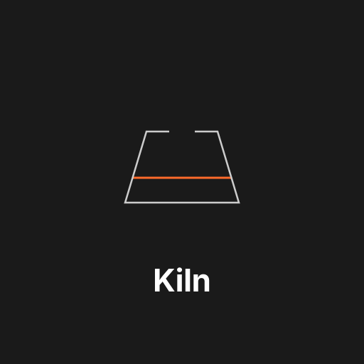

<p align="center">
  
</p>

# Kiln: The Intelligence Layer Between Ideas and Physical Objects

**Version 1.0.0 — April 2026**

> Describe it or draw it. Kiln makes it real.

## Abstract

We present Kiln, a protocol and reference implementation that enables autonomous AI agents to transform ideas -- expressed as natural language, sketches, or parametric specifications -- into physical objects through 3D printing. Kiln bridges the gap between digital intelligence and physical fabrication by providing: (1) a Design Intelligence layer with 25 FDM materials with full engineering properties, 45 brand-specific filament profiles, and 18 proven design templates; (2) text-to-3D and sketch-to-3D generation via Gemini Deep Think, Meshy, Tripo3D, Stability AI, and OpenSCAD; (3) 7-dimension printability analysis before parts reach a slicer; (4) direct control of local printers via OctoPrint, Moonraker, Creality, Bambu Lab, Prusa Link, Elegoo, and Direct USB/Serial adapters; (5) fulfillment routing through third-party providers such as Craftcloud; (6) multi-part assembly planning with clearance validation, tolerance stacking, and optional kiln-pro assembly manuals; (7) preview-confirmed print starts; and (8) real-time G-code interception for in-flight safety filtering. The system enforces safety invariants at the protocol level across 44 named printer safety profiles, and preserves parametric Design DNA for iterative refinement. Kiln does not operate its own marketplace or manufacturing network -- it searches existing 3rd-party marketplaces and routes to existing fulfillment providers.

## 1. Introduction

### 1.1 The Problem

The distance between "I need a part" and holding that part is filled with fragmented tooling, specialized knowledge, and manual labor. Every printer ecosystem -- OctoPrint, Klipper/Moonraker, Creality, Bambu Lab, Prusa Link, Elegoo, and Serial/USB-connected Marlin printers -- exposes its own incompatible control surface. Designing printable parts requires CAD expertise. Validating printability requires tribal knowledge about overhangs, bridging distances, and material behavior. Managing a mixed fleet means maintaining separate integrations for each backend.

AI agents are now capable enough to plan and execute multi-step physical tasks. But no protocol exists to give these agents safe, structured access to the full pipeline from idea to physical object.

### 1.2 Our Contribution

Kiln solves the entire pipeline:

1. **Design Intelligence.** A structured knowledge base of 25 FDM materials with full engineering properties, 45 brand-specific filament profiles, and 18 proven design templates informs material selection, structural design, joint types, and reinforcement strategies. The system provides material-aware design recommendations and structural load estimation.

2. **Text & Sketch to 3D.** Five generation backends convert ideas into printable geometry. Gemini Deep Think uses AI reasoning to produce precise OpenSCAD code from text or sketch descriptions. Meshy, Tripo3D, and Stability AI handle organic shapes via cloud APIs. A local OpenSCAD provider compiles parametric code with zero API cost. A 14-component parametric catalog provides proven primitives (gears, threads, hinges, bearings, etc.) for assembly composition.

3. **Printability Engine.** 7-dimension analysis -- overhangs, thin walls, bridging, bed adhesion, supports, warping, and thermal stress -- catches problems before they waste filament. Thermal stress heuristics and adhesion force estimation provide quantitative risk assessment. The engine fires automatically as the first step of every mesh-bearing print path -- ``slice_and_print``, ``run_quick_print``, ``run_reslice_and_print``, ``retry_print_with_fix``, ``run_benchmark``, and the AI-generation print path -- and also runs before recovery retries via the kiln-pro recovery validation gate. Designs that fail return a structured report with ``next_action`` (e.g. ``thicken_mesh_walls``, ``repair_mesh_advanced``); designs the engine can auto-repair are sliced from the repaired path. A ``skip_validation`` parameter exists on every entry point for already-validated meshes or pre-sliced 3MF inputs the validator cannot introspect.

4. **Unified Adapter Layer.** A single `PrinterAdapter` abstract interface normalizes OctoPrint, Moonraker, Creality, Bambu Lab, Prusa Link, Elegoo, and Direct USB/Serial printer control into consistent Python dataclasses. Adding a new backend requires implementing the adapter contract; all upstream consumers work automatically.

5. **Agent-Native Interface.** <!-- KILN_MCP_TOOL_COUNT:OLD --> 788 typed MCP tools and <!-- KILN_MCP_CAPABILITY_COUNT:OLD --> 795 total MCP capabilities make Kiln a first-class control layer for any MCP-compatible agent. <!-- KILN_CLI_COUNT:OLD --> 220 CLI commands with `--json` flags cover the same surface for scripting.

6. **Safety-First Design.** Pre-flight checks, preview-confirmed print starts, G-code validation, temperature limits, and confirmation gates are enforced at the protocol layer. 44 named safety profiles define hardware-specific limits. An agent cannot bypass safety checks even if instructed to.

## 2. Architecture

### 2.1 System Overview

```
                         +-----------+
                         |  AI Agent |
                         +-----------+
                              |
                   MCP (stdio) or CLI
                              |
                         +-----------+
                         |   Kiln    |
                         |  Server   |
                         +-----------+
                    /    |     |     |    \
                   /     |     |     |     \
        [Design    [Generation [Print-  [Your      [Fulfillment
        Intelligence] Backends] ability] Printers]  Providers]
         25 mats    Gemini DT   7-dim   OP/MR/BL   Craftcloud
        45 filaments Meshy     analysis CR/PL/EG/Serial
         20 patterns Tripo3D
                    Stability
                    OpenSCAD

  OP = OctoPrint, MR = Moonraker, CR = Creality, BL = Bambu Lab, PL = Prusa Link, EG = Elegoo
```

The system is organized into five functional layers. Design Intelligence informs what to build and how. Generation backends convert descriptions into geometry. The Printability Engine validates geometry before slicing. Printer adapters handle hardware communication. Fulfillment providers handle outsourced manufacturing. All layers are accessible through the same MCP tools and CLI commands.

### 2.2 Public/Pro Extension Boundary

Public Kiln is the local printer-control layer, MCP server, CLI, safety system, adapter framework, generation/validation pipeline, and third-party marketplace/fulfillment interface. kiln-pro extends that surface with paid-tier capabilities such as product generators, procedural textures, design versioning, cloud sync, team workflows, assembly manuals, recovery intelligence, and billing.

The boundary is explicit. Public Kiln discovers local paid features through `try: from kiln_pro.bridge import pro_features` and otherwise falls back cleanly. It also bundles `pro_tool_manifest.json`, a generated manifest of kiln-pro tools that lets free-tier agents discover tier-gated capabilities and return structured upgrade guidance without shipping proprietary code in the public package. When a machine is paired to the hosted Kiln REST endpoint, public Kiln can proxy tier-gated tool calls server-side; the source of paid-tier implementations remains in kiln-pro.

### 2.3 The Adapter Contract

Every printer backend implements `PrinterAdapter`, an abstract base class defining the complete surface area of printer control:

| Method | Description |
|---|---|
| `get_status()` | Returns `PrinterState` with temperatures, flags, job progress |
| `get_files()` | Lists available files as `List[PrinterFile]` |
| `upload_file()` | Uploads local G-code to printer storage |
| `start_print()` | Begins printing a named file |
| `cancel_print()` | Cancels the active job |
| `pause_print()` | Pauses the active job |
| `resume_print()` | Resumes a paused job |
| `set_temperature()` | Sets tool and/or bed targets |
| `send_gcode()` | Executes raw G-code commands |
| `get_snapshot()` | Captures a webcam image (optional) |
| `get_stream_url()` | Returns the upstream MJPEG stream URL (optional) |
| `get_bed_mesh()` | Returns bed mesh probing data (optional) |

Each method returns typed dataclasses -- never raw dicts or API-specific JSON. State is normalized to a `PrinterStatus` enum (`IDLE`, `PRINTING`, `PAUSED`, `ERROR`, `OFFLINE`). This normalization is critical: OctoPrint encodes state as boolean flags, Moonraker uses string identifiers, Bambu uses numeric codes, Elegoo uses SDCP numeric status codes over WebSocket, and Prusa Link uses nine string states. The adapter translates all of these into a single enum.

### 2.4 Safety Layer

Physical machines can be damaged by integration errors. Kiln enforces safety at four levels:

**Level 1: G-code Validation.** Before any G-code reaches a printer, it passes through `validate_gcode()`. This blocks commands known to be dangerous without explicit context: firmware reset (`M502`), EEPROM wipe (`M500` without prior `M501`), and movements beyond axis limits.

**Level 2: Pre-flight Checks.** The `preflight_check()` gate runs before every print job. It validates: printer is online and idle, target file exists on the printer, temperatures are within safe ranges for the declared material, and no existing job is active.

**Level 3: Temperature Limits and Safety Profiles.** 44 named safety profiles define per-printer-model limits -- maximum hotend and bed temperatures, axis travel bounds, and maximum feedrates. Hard limits (300C hotend, 130C bed) are enforced regardless of what the caller requests. Material-specific ranges generate warnings when targets fall outside expected bounds. A background heater watchdog automatically cools idle heaters after a configurable timeout (default 30 minutes) to prevent fire hazards.

**Level 4: Preview Confirmation.** `start_print` refuses new non-resume jobs unless the agent has rendered a recent preview, shown it to the user, and supplied a single-use confirmation token bound to the file and printer. Advanced users can bypass the gate through an explicit environment variable, and bypasses are logged.

An agent may request any operation, but Kiln will refuse operations that violate safety invariants and return a structured error explaining why.

## 3. Design Intelligence

### 3.1 Material Knowledge Base

The Design Intelligence layer maintains structured data on 25 FDM materials with full engineering properties and 45 brand-specific filament profiles. Each material entry includes mechanical properties (tensile strength, elongation, impact resistance), thermal properties (glass transition, heat deflection, print temperatures), design constraints (minimum wall thickness, maximum overhang angle, bridging distance), and recommended applications. The brand catalog maps real-world filaments (Hatchbox PLA, Prusament PETG, eSun PLA+, etc.) to engineering properties and purchase sources.

Agents query this knowledge base when selecting materials for a design. The system can recommend materials based on functional requirements (outdoor use, food safety, flexibility, heat resistance) and flag incompatibilities between material choice and design geometry.

### 3.2 Design Patterns and Templates

18 design templates codify reusable structural solutions: snap fits, living hinges, press-fit joints, threaded inserts, cantilever beams, and others. Each pattern includes recommended dimensions, material compatibility, and printability notes.

Templates provide parametric starting points for common objects. Templates preserve their parametric source, enabling agents to customize dimensions while maintaining structural integrity.

### 3.3 Structural Analysis

The structural load estimation system evaluates designs for real-world mechanical performance. Given a geometry, material, and expected load case, it estimates safety factors and identifies weak points. Design reinforcement recommendations suggest rib placement, wall thickening, and fillet additions to improve part strength.

## 4. Model Generation

### 4.1 Generation Backends

A `GenerationProvider` abstract base class defines `generate()`, `get_job_status()`, and `download_result()` methods. A `GenerationRegistry` auto-discovers providers from environment variables at startup. Five concrete providers ship:

**Gemini Deep Think (cloud + local).** Uses Google's Gemini API with deep reasoning to convert natural language or napkin-sketch descriptions into OpenSCAD code, compiled locally to STL. This two-stage pipeline (AI reasoning followed by local compilation) produces precise, parametric, watertight meshes ideal for 3D printing. Gemini reasons deeply about geometry, proportions, and printability constraints before generating code. Supports style hints (organic, mechanical, decorative). Set `KILN_GEMINI_API_KEY` to enable.

**Meshy (cloud).** AI-powered text-to-3D via the Meshy API. Asynchronous task submission with polling (typically 30s-5min). The `await_generation` MCP tool handles polling with configurable timeouts.

**Tripo3D (cloud).** High-quality text-to-3D via the Tripo3D API. Outputs GLB format with automatic STL conversion. Retry logic with exponential backoff handles rate limits.

**Stability AI (cloud).** Synchronous 3D generation -- the endpoint returns the model directly in the response body. Returns GLB format.

**OpenSCAD (local).** Agents write OpenSCAD code directly. The provider compiles `.scad` scripts to STL using the local OpenSCAD binary. Zero API cost, deterministic parametric geometry ideal for mechanical parts. A 14-component parametric catalog provides proven primitives (gears, threads, hinges, bearings, joiners) for assembly composition.

New providers can be integrated in under 100 lines by implementing the `GenerationProvider` interface.

### 4.2 Mesh Validation

A validation pipeline runs after generation, checking structural integrity without external dependencies. It parses binary and ASCII STL files, validates triangle counts, computes bounding boxes, and performs manifold (watertight) analysis via edge counting. Validation issues are categorized as fatal errors (unparseable, zero triangles) or warnings (non-manifold, extreme dimensions).

### 4.3 Design DNA

Every generated model preserves its parametric source code alongside the cached mesh. When a design needs modification, the agent retrieves the original OpenSCAD source, modifies parameters, and regenerates -- maintaining full design history and enabling iterative refinement without starting from scratch.

## 5. Printability Engine

### 5.1 Seven-Dimension Analysis

Before any generated or imported geometry reaches a slicer, the Printability Engine evaluates it across seven dimensions:

1. **Overhangs.** Identifies surfaces exceeding the material's maximum unsupported overhang angle. Flags areas that will produce poor surface quality or require supports.

2. **Thin Walls.** Detects walls below the minimum printable thickness for the target nozzle diameter. Walls too thin for a single extrusion path will fail.

3. **Bridging.** Measures unsupported horizontal spans and compares against material-specific bridging limits. Excessive bridges sag or fail.

4. **Bed Adhesion.** Evaluates the first-layer contact area relative to part height and center of gravity. Tall, narrow parts with small footprints are flagged for adhesion risk. Adhesion force estimation provides quantitative assessment.

5. **Supports.** Estimates support material volume and identifies areas where supports will be difficult to remove or will damage surface quality.

6. **Warping.** Assesses warping risk based on part geometry, material thermal contraction properties, and cross-sectional area changes. Large flat parts in high-shrinkage materials (ABS, Nylon) receive higher risk scores.

7. **Thermal Stress.** Heuristic analysis of thermal stress concentration at geometry transitions -- sharp corners, thickness changes, and layer bonding interfaces. Identifies areas prone to cracking or delamination.

Each dimension produces a score and actionable recommendations. The engine can suggest design modifications (adding fillets, thickening walls, reorienting the part) to resolve identified issues.

## 6. Multi-Part Assembly

### 6.1 Split Planning

Parts too large for a single print bed are automatically split into printable sections. The split planner considers bed dimensions, joint placement, structural integrity, and assembly order. Up to 10 parts per split plan on the free tier.

### 6.2 Assembly Validation

Multi-part assemblies undergo clearance validation (minimum gap between mating surfaces), joint detection (identifying snap-fit, press-fit, and threaded connections), and tolerance stacking analysis (cumulative dimensional error across assembled parts). The system flags assemblies where accumulated tolerances may prevent proper fit. With Kiln Pro (https://kiln3d.com/pricing), tolerance stacking gets engineering-grade chain analysis — worst-case, RSS (naive and Bender-inflated), Scholz mean-shift, and Monte Carlo with FDM-aware bias — with method-specific confidence bands (90% Bender, 97% Scholz, 99.73% MC) and out-of-spec probability, plus per-printer offsets auto-imported from your slicer profile (OrcaSlicer, Bambu Studio, PrusaSlicer).

### 6.3 Assembly Manuals

When kiln-pro (https://kiln3d.com) is installed, the assembly interface can generate a printable PDF manual from the same assembly JSON. The public contract is simple: assemblies declare parts, positions, materials, mating interfaces, clearances, magnet polarity when relevant, and optional fastener metadata. kiln-pro turns that into a cover render, bill of materials, per-step isometric pages, verification gates, sidecar JSON, and per-page PNG previews that agents can display inline.

Manual generation is deliberately evidence-based. If an assembly lacks the metadata needed to describe a joint confidently, the generator returns a structured remediation error instead of shipping a vague instruction. Multi-language and co-brand options are kiln-pro Business+ features (https://kiln3d.com/pricing). Manuals can also be embedded into 3MF packages with a signed manifest so downstream recipients can verify authenticity.

## 7. Search 3rd-Party Marketplaces

Kiln mirrors its printer adapter pattern for model discovery. A `MarketplaceAdapter` abstract base class defines a uniform interface -- `search()`, `get_details()`, `get_files()`, `download_file()` -- implemented by concrete adapters for MyMiniFactory (REST v2), Cults3D (GraphQL; metadata-only, no direct downloads), and Thingiverse (REST). Each adapter normalizes API-specific JSON into shared dataclasses (`ModelSummary`, `ModelDetail`, `ModelFile`).

A `MarketplaceRegistry` manages connected adapters and provides `search_all()`, which fans out queries in parallel using a thread pool and interleaves results round-robin across sources. Per-adapter failures are caught and logged without poisoning the aggregate response.

Kiln searches existing 3rd-party marketplaces. It does not operate its own model marketplace.

## 8. Slicer Integration

Raw STL/3MF geometry must be sliced into G-code before printing. Kiln wraps PrusaSlicer and OrcaSlicer CLIs with automatic detection from PATH, macOS application bundles, or the `KILN_SLICER_PATH` environment variable.

The `slice_and_print` operation combines slicing, upload, and print start into a single atomic action. The `design_to_gcode_pipeline` MCP tool collapses the full pipeline -- design, generate, validate, slice -- into a single workflow.

## 9. Route to Fulfillment Providers

Kiln routes manufacturing jobs to existing third-party fulfillment providers. It does not operate its own manufacturing network.

**Craftcloud.** Aggregates quotes from 150+ print services worldwide across FDM, SLA, SLS, MJF, and metal (DMLS). Normal users route through Kiln's hosted fulfillment path; operators can use direct mode with their own provider credentials. No printer needed.


Kiln provides a fulfillment intelligence layer above individual providers: health monitoring with automatic skip on consecutive failures, cross-provider quote comparison (cheapest, fastest, recommended), batch quoting for multi-part assemblies, retry with provider fallback, and persistent order history.

For all fulfillment orders, the provider remains merchant of record. Kiln charges a 5% orchestration fee (first 3 per month free, $0.25 minimum, $200 maximum per order).

## 10. Fleet Management and Job Scheduling

### 10.1 Printer Registry

The `PrinterRegistry` maintains a map of named printers with their adapter configurations. Printers can be added via CLI (`kiln auth`) or MCP tool (`register_printer`). The registry supports heterogeneous fleets -- a single Kiln instance can manage OctoPrint, Moonraker, Creality, Bambu, Prusa Link, Elegoo, and Direct USB printers simultaneously.

### 10.2 Job Queue

The `JobQueue` accepts print jobs with optional priority levels and dispatches them to available printers. Jobs progress through states: `PENDING` -> `DISPATCHED` -> `PRINTING` -> `COMPLETED` (or `FAILED`, `CANCELLED`). The queue persists to SQLite, surviving server restarts.

### 10.3 Scheduler

The `Scheduler` runs a background loop that matches pending jobs to idle printers. Failed jobs are retried up to a configurable limit (default 2 retries). For unassigned jobs, the scheduler applies history-based smart routing: it queries each candidate printer's historical success rate with the job's file hash and material type, then dispatches to the printer with the highest success rate. This allows the fleet to self-optimize over time.

## 11. Cost Estimation

The cost estimator parses G-code to compute filament length, weight, and material cost based on material profiles. It extracts estimated print time from slicer comments and calculates electricity costs. Combined with smart recommendations, agents can compare the cost of local printing versus fulfillment services before committing.

For manufacturing bureaus and kit sellers, kiln-pro Business adds per-part economics for sliced multi-object `.gcode.3mf` plates. The public interface remains whole-job cost estimation; the paid extension breaks a plate into object-level time, filament, material cost, electricity, and totals for quoting and replacement-part pricing.

## 12. Event System and Webhooks

All significant state changes emit events through a pub/sub event bus: job state transitions, printer status changes, errors. Events are persisted to SQLite. External systems can register HTTP webhook endpoints for specific event types. Payloads are signed with HMAC-SHA256 when a secret is provided.

## 13. Monitoring

### 13.1 Vision Monitoring

Kiln does not embed its own computer vision model. It provides structured monitoring data -- webcam snapshots, temperature readings, print progress, layer metadata, and phase-specific failure hints -- and delegates visual analysis to the agent's own vision model. This keeps Kiln model-agnostic and automatically benefits from improvements in the agent's vision capabilities.

Prints are classified into three phases (first layers, mid print, final layers) with phase-specific failure hints. `monitor_print_vision` captures a single snapshot with full context. `watch_print` creates a continuous monitoring loop with configurable intervals.

### 13.2 Print Tracking and Materials

The `kiln wait` command blocks until a print completes. `kiln history` queries past print records. The materials module tracks loaded filament per extruder, maintains spool inventory, and emits events when spools run low.

### 13.3 Bed Leveling Automation

Bed leveling can be triggered automatically based on configurable policies: maximum prints since last level, maximum hours elapsed, or before the first print.

## 14. Cross-Printer Learning

Agents record structured print outcomes after each job: success/failure, quality grade, failure mode, print settings, and environmental conditions. All recorded data passes through safety validation.

`get_printer_insights` aggregates outcome history per printer. `suggest_printer_for_job` ranks available printers by historical success rate for a given material and geometry. All learning data is advisory -- it informs decisions but never overrides safety limits.

## 15. Security

### 15.1 Physical Safety

The safety system is described in Section 2.4. Additionally, 44 named printer-specific safety profiles define model-specific limits loaded at startup and checked on every temperature and G-code command.

### 15.2 Authentication and Authorization

Authentication is optional and disabled by default for local deployments. When enabled, the `AuthManager` enforces API key verification with SHA-256 hashed keys, scope-based access control (`read`, `write`, `admin`), key rotation with grace periods, and auto-generated session keys.

Enterprise deployments support SSO via OIDC or SAML, hierarchical RBAC, team/org scopes, approval gates, session policy, MFA step-up for sensitive operations, and SCIM 2.0 provisioning endpoints.

### 15.3 Network Security

Rate limiting (default 60 requests/minute), explicit CORS whitelisting, SSRF prevention on webhook delivery, and HMAC-SHA256 signed payloads.

### 15.4 Agent Safety

Tool output sanitization strips prompt injection patterns and truncates to configurable limits. A privacy mode redacts IP addresses, tokens, and authorization headers. Tool tiers restrict weaker models to essential tools only.

### 15.5 Data Protection

Parameterized SQL queries, no `eval()` or `exec()`, explicit plugin allow-lists with fault isolation, and credential file permission checks.

Enterprise features include encrypted G-code at rest (Fernet symmetric encryption with PBKDF2 key derivation), lockable safety profiles that prevent agent modification, hash-chained REST audit events, and full audit trail export in JSON/CSV for compliance.

### 15.6 Enterprise Deployment

On-premises deployment via Kubernetes manifests and Helm chart with namespace isolation, network policies, persistent volumes, horizontal pod autoscaling, and air-gapped environment support. Dedicated single-tenant MCP server instances. 99.9% uptime SLA with rolling health monitoring.

## 16. Revenue Model

Local printer control is free and unrestricted. Kiln uses a four-tier model:

- **Free** -- Unlimited local printing, slicing, marketplace search, safety profiles, a 10-job queue, one printer, personal/non-commercial use, design intelligence, printability analysis, and local linear design history.
- **Pro ($49/mo, $39/mo annual)** -- Everything in Free plus one-printer personal use, unlimited queue depth, unlimited assembly parts, auto-generated assembly manuals, Git-for-3D branch/merge/cherry-pick/signed releases, solo cloud sync, product templates, procedural textures, unlimited non-QR decorations, mid-print modification, failure recovery, print resume, design provenance, manual speed control, and print learning.
- **Business ($199/mo, $159/mo annual)** -- Everything in Pro plus commercial use, 3 printers, 3 team seats, multi-printer fleet management, cross-printer learning, co-branded and multilingual assembly manuals, QR code generation, layer-scheduled speed adjustments, team pull requests, approval gates, federated design sharing, unlimited fulfillment orders, material compliance tracking, priority support, custom safety profiles, and webhooks.
- **Enterprise (custom)** -- Everything in Business plus large fleets, unlimited team seats, SSO, SCIM, RBAC, full audit trail with long-term retention, lockable safety profiles, encrypted G-code at rest, white-label manuals, buyer-side authenticity verification, 99.9% SLA, dedicated CSM, on-prem/VPC deployment, custom integrations, and procurement terms.

Fulfillment orders carry a 5% orchestration fee (first 3/month free, $0.25 min, $200 max). Providers remain merchant of record.

Crypto donations accepted at kiln3d.sol (Solana) and kiln3d.eth (Ethereum).

## 17. Consumer Workflow

Kiln extends beyond printer owners to serve users who have never touched a 3D printer. A guided onboarding pipeline walks agents through model discovery or generation, material recommendation (10 consumer use cases mapped to ranked material recommendations), price estimation, quoting, address validation, order placement, and delivery tracking.

## 18. Future Work

- **Remote agent collaboration.** Enable multiple agents to coordinate across a shared printer fleet.
- **Federated learning.** Aggregate anonymized print outcomes across Kiln instances (opt-in) for community-level printer insights.

## 19. Conclusion

Kiln demonstrates that the gap between an idea and a physical object can be collapsed to a single conversation. By combining Design Intelligence, text-and-sketch-to-3D generation, 7-dimension printability analysis, unified printer control, and fulfillment routing into a single protocol, Kiln transforms any MCP-compatible agent into a complete manufacturing partner. The system is local-first, open-source, and extensible to new design tools, generation backends, printer firmware, and fulfillment providers.

---

*Kiln is open-source infrastructure released under the GNU Affero General Public License v3.0 (AGPL-3.0). Commercial licensing is available for organizations that require proprietary use.*
*Kiln is a project of Hadron Labs Inc.*
